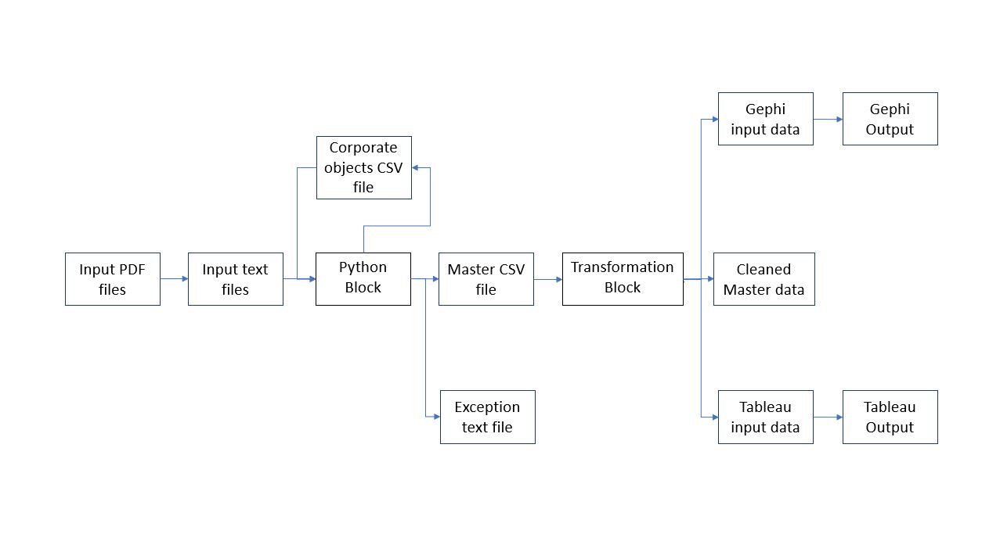
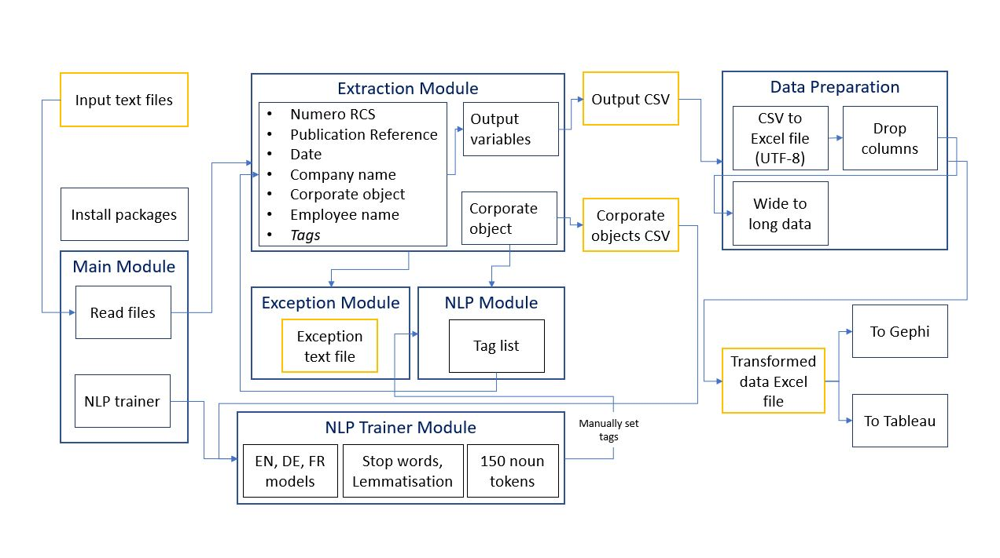

# Semantic analysis of Luxembourg company acts & other public information

## Objectives
1. Being able to compare one company to other entities based on key characteristics described in their official documents in PDF (corporate objects, addresses, board members, Direct parent, etc...)
2. Matching concepts and entities across unstructured/disparate data sources
3. Visualisation by cluster according to multiple criteria
4. Being able to query this universe of companies to make knowledge discovery  possible (relationship, similarities, …)

## Project High Level Design

## Data Extraction & Preparation Design

## Data Extraction
Python Jupyter notebooks used for the data extraction segment

## Data Preparation
Data prepared for visualization using MS Excel

## Visualization 
1. Gephi used for network analysis of companies & employees
2. Tableau used for analysis of corporate objects

