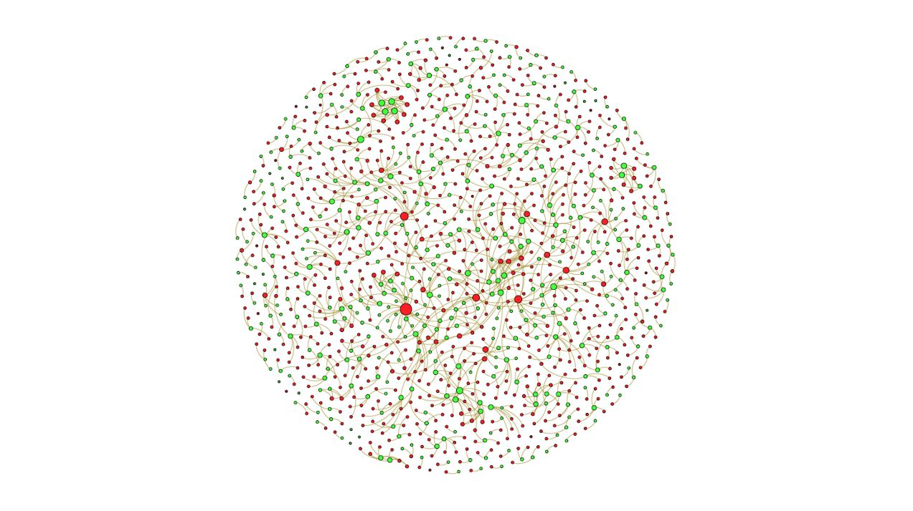
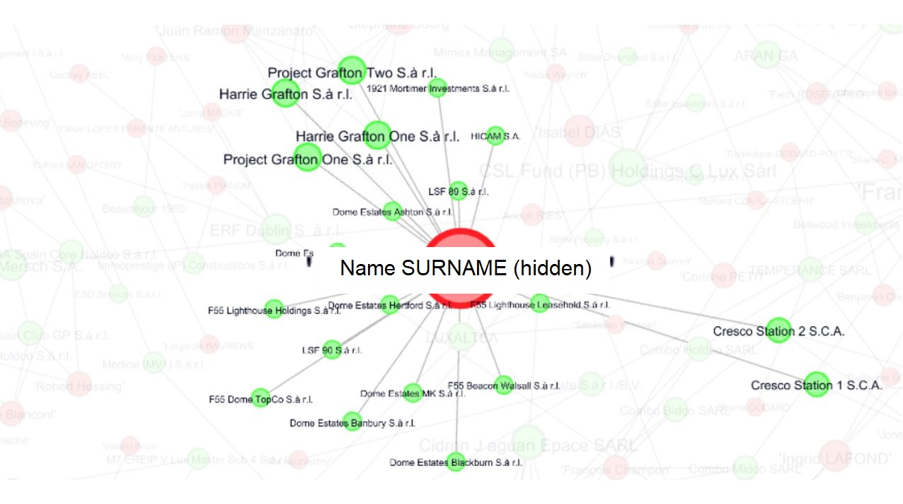
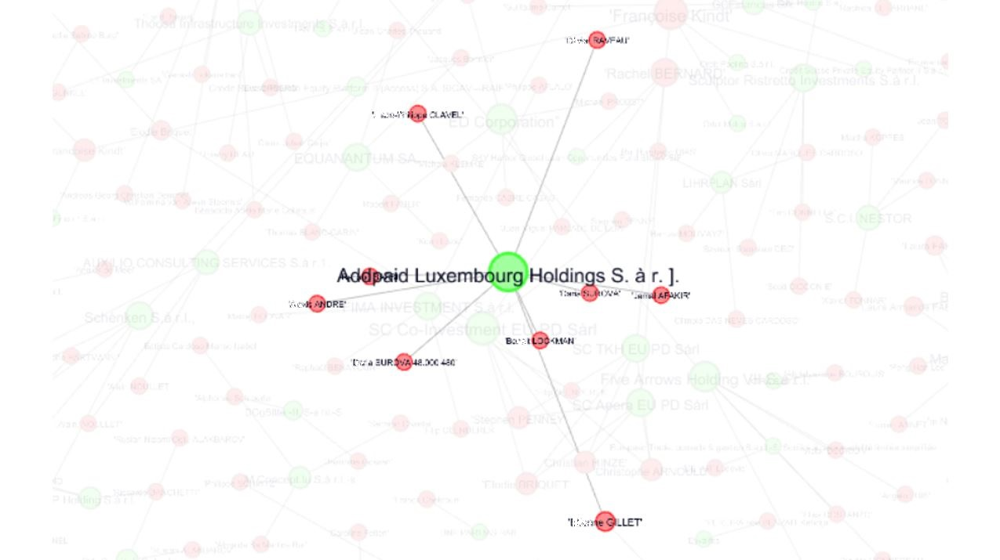
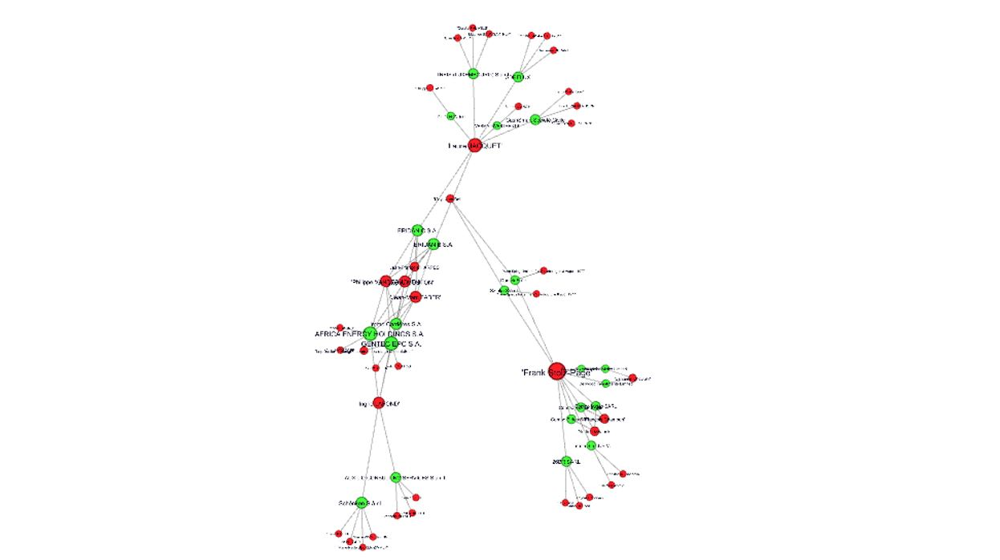
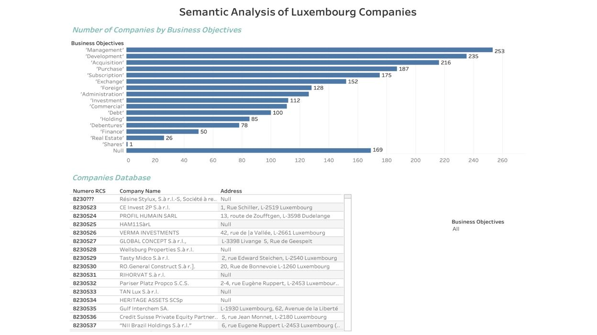

# Gephi Output
Gephi is a free software used for extensively for network & statistical analysis. One major limitation include adding and displaying additional information in each node. Complemented with other visualization tools.
Gephi was used to establish links between employees & companies.

### Network Universe

Employee nodes set in red & companies in green. Node size set by number of connections. Fruchterman Reingold layout.

### Employee -> Company

Single employee connected to multiple companies. Suggests possible board-interlocking or presence of sister companies.

### Company -> Employee

Single company connected to multiple employees.

### Entire cluster

Running the Yifan Hu layout followed by the Noverlap layout isolates all connected nodes & subnodes as a single cluster.

# Tableau Output
Tableau ouput is complemented with the Gephi output. It is used to segregate companies on the basis of their corporate object. Selecting a corporate object tag lists all companies and their relevant information working under similar corporate objectives.

### Dashboard

